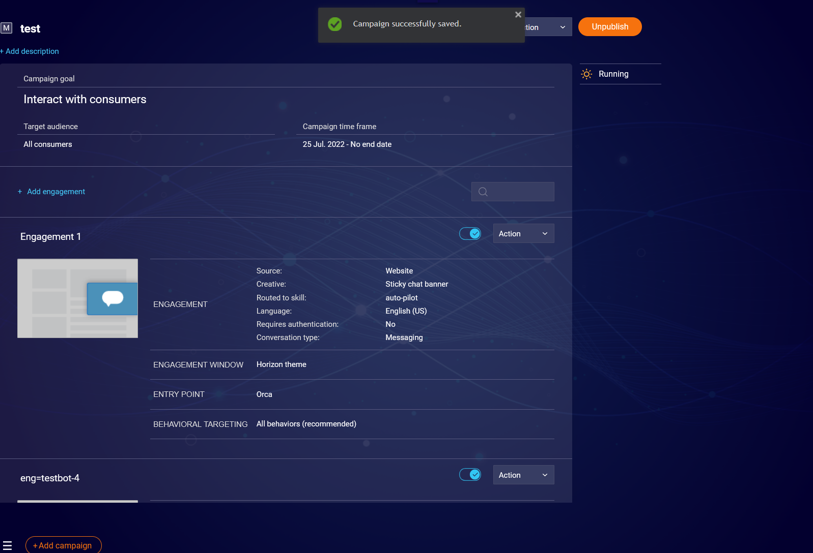

***campaign overview:
a campaign uses:
campaigns API
engagements
goals
visitor behaviours
audiences (visitor profiles)
window configuations
onsite locations (website pages)

it may also use
account properties
connectors
installations

LP Conv Cloud Campaign builder:

**example API responses:

services/backend/src/Controllers/LivePerson/AccountConfig/window.confs.json
services/backend/src/Controllers/LivePerson/AccountConfig/account-config.module.ts
services/backend/src/Controllers/LivePerson/AccountConfig/account-properties.json
services/backend/src/Controllers/LivePerson/AccountConfig/campaign.json
services/backend/src/Controllers/LivePerson/AccountConfig/campaigns.postman.json
services/backend/src/Controllers/LivePerson/AccountConfig/campaigns.response.json
services/backend/src/Controllers/LivePerson/AccountConfig/connectors.json
services/backend/src/Controllers/LivePerson/AccountConfig/goals.json
services/backend/src/Controllers/LivePerson/AccountConfig/installations.json
services/backend/src/Controllers/LivePerson/AccountConfig/kpis.json
services/backend/src/Controllers/LivePerson/AccountConfig/onsite-locations.json
services/backend/src/Controllers/LivePerson/AccountConfig/private-apis.md
services/backend/src/Controllers/LivePerson/AccountConfig/readme.md
services/backend/src/Controllers/LivePerson/AccountConfig/visitor.behaviours.json
services/backend/src/Controllers/LivePerson/AccountConfig/vistior.profiles.json

publish:
POST
	https://ause1.ac.liveperson.net/api/account/31487986/configuration/le-campaigns/campaigns/1487706770?v=3.4&__d=82971

  res:
  

unpublish:
POST
https://ause1.ac.liveperson.net/api/account/31487986/configuration/le-campaigns/campaigns/1487706770?v=3.4&__d=45469

Goals
GET
	https://ause1.ac.liveperson.net/api/account/31487986/configuration/le-goals/goals?v=3.0&select=$summaryDeleted&_=1765318111012&__d=25443

POST
	https://ause1.ac.liveperson.net/api/account/31487986/configuration/le-goals/goals?v=3.0&__d=85284
{"id":null,"name":"whatever","description":"","type":0,"indicatorType":0,"indicatorValue":{"url":"confirmed","matchType":0,"reachedCounter":1}}

deleting goal:
POST
	https://ause1.ac.liveperson.net/api/account/31487986/configuration/le-goals/goals/4440268273?v=3.0&__d=51525

visitor behaviours
GET
	https://ause1.ac.liveperson.net/api/account/31487986/configuration/le-targeting/visitor-behaviors?v=2.0&_=1765318111013&__d=4687

  onsite locations
  https://ause1.ac.liveperson.net/api/account/31487986/configuration/le-targeting/onsite-locations?v=3.0&_=1765318111014&__d=64455

  window configurations
  GET
	https://ause1.ac.liveperson.net/api/account/31487986/configuration/engagement-window/window-confs?v=2.0&_=1765318111015&__d=20623

  account properties (also used elsewhere)
  GET
	https://ause1.ac.liveperson.net/api/account/31487986/configuration/setting/properties?v=3.0&context_type=ACCOUNT&context_cascading=true&groups=messagingSkillSelection&_=1765318111017&__d=23439

  private applications
  GET
	https://ause1.ac.liveperson.net/api/account/31487986/configuration/app-install/installations?v=2.0&_=1765318111018&__d=89526

  visitor profiles
  https://ause1.ac.liveperson.net/api/account/31487986/configuration/le-targeting/visitor-profiles?v=2.0&_=1765318111019&__d=7967

  lines of business (lobs)
  ET
	https://ause1.ac.liveperson.net/api/account/31487986/configuration/le-users/lobs?v=2.0&_=1765318111020&__d=37687

  goals

  engagement:
  
  delete:
  POST
	https://ause1.ac.liveperson.net/api/account/31487986/configuration/le-campaigns/campaigns/1542126270/engagements/4123148970?v=3.4&__d=56497
  no req or res observed

  create
  POST
	https://ause1.ac.liveperson.net/api/account/31487986/configuration/le-campaigns/campaigns/1542126270/engagements?v=3.4&__d=22280

  enable:
  GET
	https://ause1.ac.liveperson.net/api/account/31487986/configuration/le-campaigns/campaigns/1542126270/engagements/4440310375?v=3.4&_=1765345670365&__d=65441

  get headers:
  HTTP/3 200 
x-lp-host: D7584C445757B22654FD618B176881A3
set-cookie: JSESSIONID=F71C9D89D711F6E1B8FDDC296E0268F3; Path=/; HttpOnly
ac-revision: 692
content-type: application/json
content-length: 2637
date: Wed, 10 Dec 2025 05:48:52 GMT
strict-transport-security: max-age=31536000; includeSubDomains
x-content-type-options: nosniff
via: 1.1 google
alt-svc: h3=":443"; ma=2592000,h3-29=":443"; ma=2592000

POST
(use revision ffrom headers in last get and add to If-Match header: e.g: If-Match
	692)
https://ause1.ac.liveperson.net/api/account/31487986/configuration/le-campaigns/campaigns/1542126270/engagements/4440310375?v=3.4&__d=51648

User Widgets (Content tab)
GET (use this one)
	https://ause1.acr.liveperson.net/api/account/31487986/configuration/le-ui-personalization/widgets?v=2.0
  
  (just for reference to show possible url params)
  GET
	https://ause1.ac.liveperson.net/api/account/31487986/configuration/le-ui-personalization/widgets?v=2.0&select=$all&return=active&_=1765748682227&__d=6054

RES: services\backend\src\Controllers\LivePerson\AccountConfig\widgets.json

  GET
	https://ause1.promptlibrary.liveperson.net/v2/system/prompts?source=ccui&__d=72210
RES:  services\backend\src\Controllers\LivePerson\AccountConfig\prompts-system.json

  GET
	https://ause1.promptlibrary.liveperson.net/v2/accounts/31487986/prompts?source=ccui&__d=85395
RES: services\backend\src\Controllers\LivePerson\AccountConfig\prompts-account.json

Prompt Providers
  GET
	https://ause1.promptlibrary.liveperson.net/v2/accounts/31487986/configurations/llm-providers?source=ccui&__d=64869

RES: services\backend\src\Controllers\LivePerson\AccountConfig\llm-providers.json