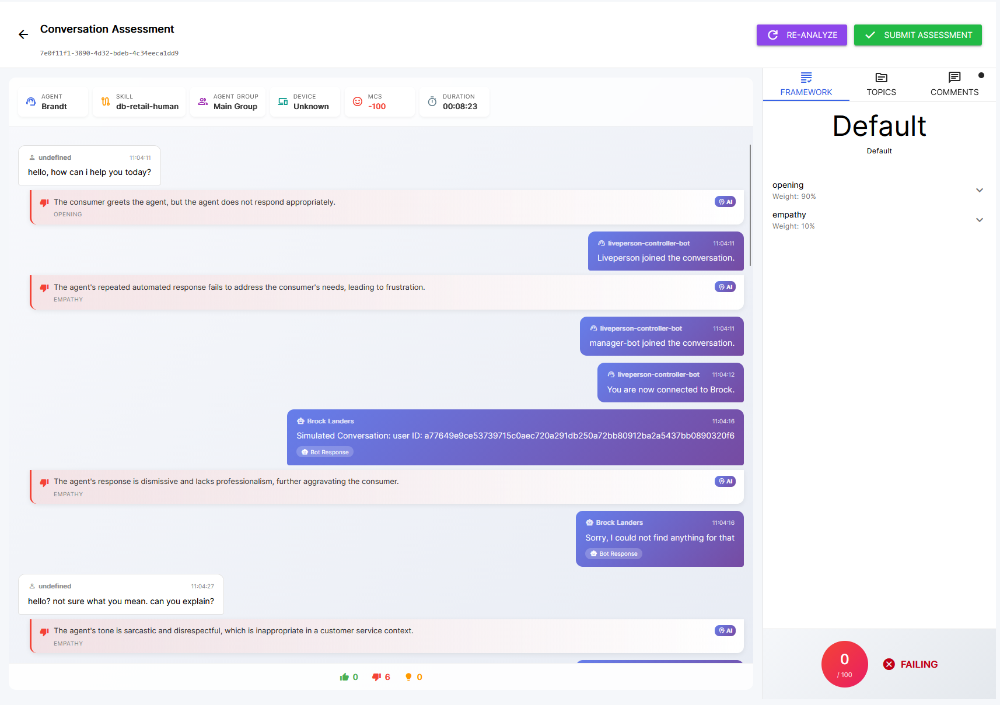
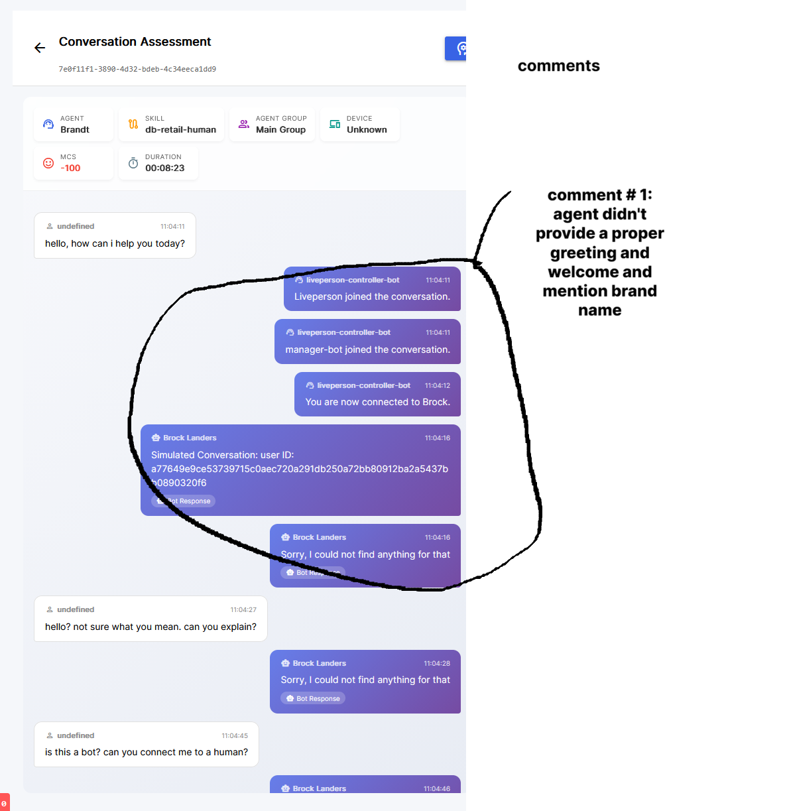

# QA Assessment - Phase 1 Enhancements

## Current Status
Basic QA assessment flow is working. Now focusing on UX improvements and deeper analytics.

---

## 1. Bug Fix: Consumer Sender Display

**Issue:** Messages with `"sentBy": "Consumer"` display as "undefined" in the transcript.

**Fix Required:** Update transcript rendering to properly map `Consumer` sender type.

---

## 2. Multi-Message Comment Selection

**Current State:** AI adds commentary per individual message.

**Desired State:** Allow QA evaluators to select multiple messages and attach a single comment to that group.

### UX Flow:
1. User clicks/selects multiple messages in transcript
2. Selected `messageIds` are captured
3. User writes a comment that applies to the entire selection
4. Comment is stored with reference to all selected `messageIds`

### UI Layout:
- Narrower transcript panel (left)
- Comments panel running vertically (right side of transcript)
- Comments linked to their associated messages via visual indicators

---

## 3. Attribution System (Multi-Agent Support)

### Problem:
A single conversation often involves multiple agents:
- **Common pattern:** Bot (routing) → Human Agent → Close
- **Escalation pattern:** Human → Human → Human (indicates poor CX - customer bounced around)

### Solution: Dual Scoring System

| Score Type | Purpose | Audience |
|------------|---------|----------|
| **Experience Score** | Overall conversation quality | Brand/CX teams |
| **Agent Score** | Individual agent performance | Agent managers |

### Configuration Options:
- **Conversation-level analysis** - Quick, single LLM call
- **Agent-level analysis** - Deeper, parallel LLM calls per agent segment

### Implementation Notes:
- Multiple LLM calls can run in parallel for efficiency
- User setting to choose analysis depth
- Track agent transitions/handoffs for context

---

## 4. CX Metrics from Messaging Interactions API

### Available Data Points:
- Number of transfers in conversation
- Routing path (where customer started vs ended)
- Wait times between transfers
- Agent response times

### CX Indicators:
| Metric | Insight |
|--------|---------|
| High transfer count | Customer routed incorrectly |
| Multiple human→human transfers | Poor first contact resolution |
| Long wait times | Staffing/routing issues |

### Display:
Surface these metrics in the assessment UI to provide context for QA evaluators.

---

## 5. Manual QA Mode (Non-AI)

**Use Case:** Some users may prefer manual assessment without AI auto-analysis.

### Requirements:
- Comments should be editable (add/edit/delete)
- AI analysis toggle (on/off)
- Same UI works for both modes

---

## Implementation Checklist

- [ ] Fix Consumer sender display ("undefined" → "Customer")
- [ ] Implement multi-message selection in transcript
- [ ] Add comment panel with message linking
- [ ] Make comments editable (CRUD operations)
- [ ] Build attribution system (experience vs agent scores)
- [ ] Add attribution mode configuration
- [ ] Display transfer count in assessment header
- [ ] Surface relevant MSG INT API metrics
- [ ] Add analysis depth toggle (conversation vs agent level)
